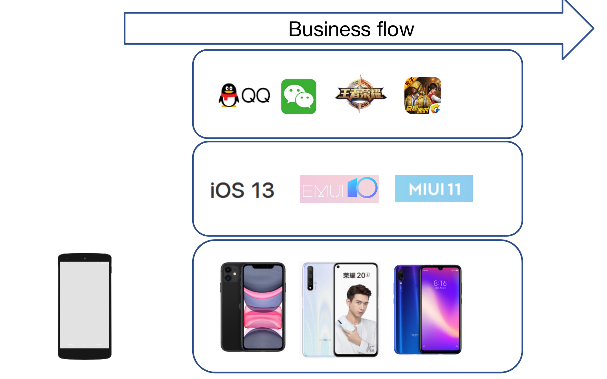
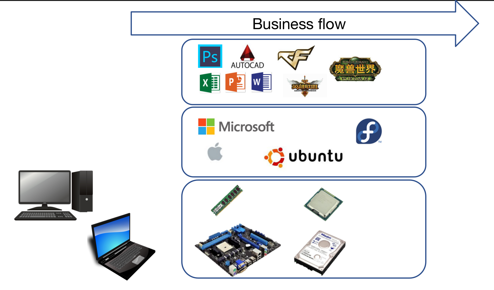
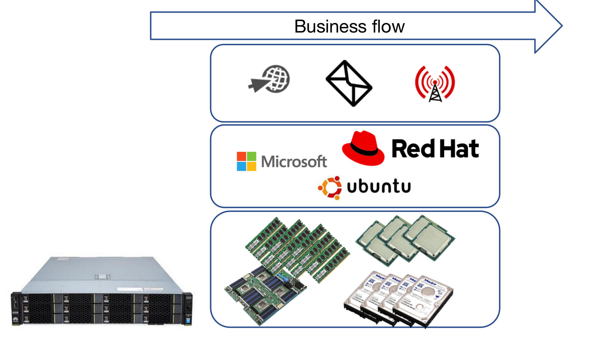

# 02- 硬件 系统 应用 业务流 模型 和 皮卡车模型

## &#x20;当第一台“电脑”变成了手机

&#x20; 虽然我是从2011年就获得了第一份IT相关领域的工作，做外包的桌面支持、机房运维、服务器搬运工。但是，当我真正拥有一台属于自己的电脑的时候是3年以后了。电脑来的 时候自带系统，那个时候也是拿着就用什么也没有多想，等到后来换过几次电脑，重装过几次系统之后，才开始渐渐的理解了操作系统、用户习惯、应用生态等等，等过了几年移动端的市场开始发力，之后到 几乎人手一个智能机的时候，电商才慢慢发展起来，那会京东的域名还是 360buy，淘宝感觉还是一个充满欺骗的蛮荒之地，没有618  818  双十一的购物节，团购电影票才刚刚兴起。经过了4G  5G的发展，在地铁上用手机流量追个喜欢的流行电视剧不再是问题，再也不用费劲巴拉的找到一个BT网站下载下来后再导入到手机中去查看。短视频平台的兴起又将人们本来被碾碎的注意力进一步磨成了粉末。

&#x20; 时间回到现在，我突然发现周围的很多人在真正有用一台传统意义的电脑之前，他们所拥有的计算设备其实就是一台智能手机，等到到了学校 或者 进了单位才开始使用电脑，用起来的时候也是 有什么就用什么，几乎从来没有想过他们的分类，背后的厂商，到现在，用着的产品是他们的那根产品线上的东西，这个产品的生命周期又是多少，至于什么是摩尔定律，什么又是安迪比尔定律，那些该死的定律就让他们躺在学校里的试卷上吧，我毕业了，我有工作了，那些定律跟现在的我有半毛钱的关系？！我又不用再去参加考试了！！！再也不用了！！！

&#x20; 我想说的是，当然和你我都有关系，毕了业之后才是很正开始自己认知世界的开始。世界很大我们可以先从身边的手机说起。先从 自己身边的电子设备 入手  不用拆，你就放在那里 或者 假装自己拥有 跟着我一起思考就可以。

## 先从低头看一下我们的手机开始吧

&#x20;周围的人可能会用 苹果的 iPhone ， 安卓阵营的 小米 华为等等。看起来似乎 眼花缭乱，无穷无尽，但是只要我们 按照一个 ，产商，产品线，产品的 理念就能够把相关的事物进行快速的分类你不需要知道市面上总共在售卖的有多少种产品，你大概只需要知道几个产品领域的头部产商，每个厂商大概有几个该领域的产品线，在每条产品线上最新的产品大概是什么就可以了。有了这个模型，你就知道市面上哪些手机是要被淘汰掉的。哪些手机会在几个月后出现在市面上。

我们来从手机上迭代出一个 简单的模型：

<figure><figcaption></figcaption></figure>

可以看到 不论我们手里拿着的 是  苹果的 iPhone 还是 华为的 荣耀 ，或者是小米的某款手机。他们其实都只是一个”铁盒子“而已，之所以我们能够使用它们是因为他们自带了产商的操作系统，并且在上面拥有对应的软件。我们真正用手机 其实是跑的业务流，只不过”网瘾少年”们 卡在来 手机游戏里面。单身汉 卡在用微信约不来妹子一起吃饭的地方。

简单的理解就是 下面是 硬件，中间是 操作系统，上面是 应用程序，最顶上是业务流。

一旦拥有了这个模型之后，我们就可以在很多地方都用它来进行拆解，归纳总结。一个很典型的例子就是我们的电脑。

## 从手机 到 个人电脑

好吧 终于说到了电脑，这里指的是 个人电脑，就是那种放在桌子上的 台式机或者笔记本，拥有 鼠标键盘 屏幕的 那种电脑。我们会在上面 聊微信 、逛京东淘宝、写毕业论文、写标书、打Dota2  LOL的 电脑。

其实也一样。

<figure><figcaption></figcaption></figure>

台式机也好，笔记本也好，下面的的这些 都是硬件。中间是不同产商的操作系统，上面是应用。我猜大部分同学在之前使用电脑的大部分时间都放在了游戏和娱乐上面，等到真正快毕业了，或者 工作中 遇到合同、标书 等的时候  才会 把自己时间 放到一些生产力的工具上。这都很正常，别担心。

上面的系统里，我认为 最好用的 还是 微软的 Windows系统 ，因为 从历史上讲人家毕竟全球垄断过，从生态上讲它上面的的 软件生态最齐全，很多硬件厂家新出了硬件 都会第一时间去找微软去做适配。再加上这么多年的软件环境的生态演化，其实如果你真的知道该怎么配置你的电脑的话，它的生产效率还是挺高的。

之后，我认为第二好用的是苹果公司的的MacOS操作系统，搭配上他们独特的硬件，使得整个机器用起来丝滑无比，再加上流畅的UI设计，用起来真的是得心应手。

最后，我认为第三好用的 才是 Linux的桌面端，告别了微信聊天 钉钉 百度网盘等等的国内软件环境之后，你会发现如果你的所有业务流都只是 需要一个 终端软件和一个 浏览器 就能够搞定的话，那么这台机器 就是你通往天堂的电车。当然前提是你的中文打字速度上不了130字每分钟的话，不然系统自带的智障拼音输入法会把你从电车上 一次次的甩下来 重重的摔在地上。

最后的 最后，对我来说Win也好  Mac也好 Fedora 等 Linux 桌面也好，我认为他们都是非常不错的工具，按照你的生存环境 业务流环境 去选择最适合你的工具就好了。

三种不同的PC环境，代表着三种不同的生态，三种不同的价位，三种不同的思维方式，三种不同的用户习惯，三种不同的人群。

大部分的应用厂商都做了 Win和 Mac的适配，Linux 版本的应用适配似乎永远被落下了，更多的时候，Linux用户只能 捡这应用厂商做出来的 应用Web版本去使用，大部分情况下 Web版本的功能数量 要远低于 Win 或者 Mac上面的功能数量。

说完了个人电脑，下面让我们去看看 服务器端的 样子。

## 从个人电脑 到 服务器

&#x20; 其实在互联网数以万计的网站背后，有一批设备在支撑着我们每日的上网需求：网络购物，获取咨询，达成交易，观看影片、12306的买票回家，等等，不论我们是在移动端的手机上面，还是在个人电脑端上完成这些需求的满足，背后都有着同一批伟大的设备。

&#x20; 它们躲在恒温机房里面，7x 24小时不断的运行，上面跑着的是研发人员编写的程序，没日没夜的服务着成败上千的人们的上网需求。

&#x20; 是的它们就是服务器。

&#x20;  当你每一次用电脑打开一个网页，每一次用手机微信发送一个消息，观看每一条短视频，从网盘中下载每一个文件的时候，等等这些操作的背后都有一群服务器在你不知道的地方默默的服务着你。

同样，它们仍然可以用下面的一个模型来简单的分类

<figure><figcaption></figcaption></figure>

硬件方面：服务器上拥有相对于 个人电脑更强悍的硬件支持，比如，更多的CPU插槽，更多的内存插槽，更给力的网卡，更多的磁盘盘位。等等。

操作系统层面：上面安装的通常情况下就不是我们个人电脑上面的操作系统了。通常情况下它上面会装上服务器级别的操作系统。微软的 Windows Server 或者 红帽软件 的 RHEL 等等。

应用层面：安装好操作系统以后上面的应用也是服务器级别的，比如 一个网站应用。一个 邮件服务器应用。一个流媒体 应用等等。随着行业的发展在服务器操作系统层面上可以部署的企业级应用早就变成了数以千计的样子。这不禁让我联想到了另外的一个模型，就是 丰田的皮卡车。

下面就让我们来从皮卡车模型入手，介绍到 内核的部分。

## 皮卡车模型

<figure><figcaption></figcaption></figure>

右边图片中的 丰田皮卡车 就类比 ，企业解决方案中的 操作系统层。皮卡车上面 挂载上不同的负载 可以 去应对不同的 场景。

<figure><figcaption></figcaption></figure>

如果把服务器操作系统比作皮卡车的话，内核 就类似于 皮卡车的发动机。内核的源代码就类似于 发动机中的不同零件，各个零件本身也在迭代升级，每一次的迭代升级都通过 git 仓库中的commits 来完成，这些都发生在 内核 的 git 仓库中。实际工作中的场景如下图：

<figure><figcaption></figcaption></figure>

真正的世界中 左边的 两个 ”The Commits“和  ”The Kernel Source Code“其实都发生在 git 仓库里面。

<figure><figcaption></figcaption></figure>

一旦你拿到了  Kernel的 git仓库 ，clone下来之后就是一堆 文件目录树在你的本地。此时使用 git log的时候就会看到 某个 commit 后面会带有一个  tag 的样子，里面的命名会是一个 内核 rpm包的命名方式，那就代表着那个 commit的目录树 状态下 编译出来了一个 内核的 rpm包。对于红帽这边，从源码编译出来的二进制内核 rpm包 会另存为到另外的一个地方。之后便是 在制作发型版的时候将内核的rpm包融入到对应的发行版本中，但是此刻需要注意一下，不是每个 版本的 rpm包 都会被集成到某一个  发型版本的ISO镜像里面，比如上图中的右边紧挨着的 两个 RHEL发行版 他们就把  kernel-4.18.0-495.el8的 rpm包 丢下了。

<figure><figcaption></figcaption></figure>

至此我们已经拥有了两个 模型。一个是帮助理解 操作系统在哪里的 模型

底层硬件 -> 操作系统-> 应用程序-> 业务流

另外一个是 帮助理解  操作系统 内核 源码  和commit他们之间关系的模型。

能跑的皮卡车(操作系统)->皮卡车的发动机(内核）->发动机零件(内核源码)->发动机零件的更新(commit)

现在大地图有了，剩下的就是 找标杆，把事情做成了。

