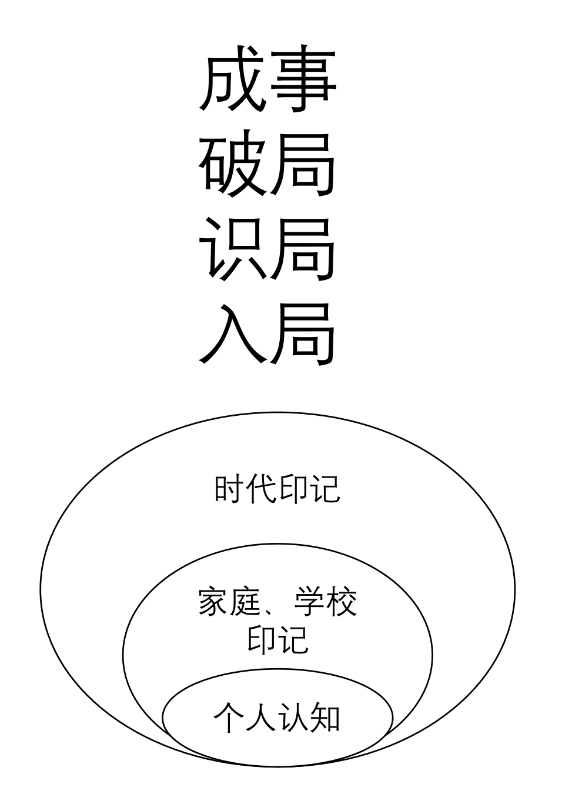

# 03-标杆 与 成事

## 标杆

一直以来 想要将自己 避免的一个自我认知的 陷阱 。

“我是我们村跑得最快的，为什么国家选运动员不来找我”

看似一个笑话，但是如果我们可以来仔细分析一下这个问题，其实 还有蛮多可以推敲的地方，那么下面我就来献丑说一下我关于这个笑话的理解。

这个段子是我在刷图库的时候看到的，我记得那个图片是来自知乎的一个问答截图。先收一下我们内心中的想笑的情绪，来设身处地的思考一下提出这个问题的人的思维状态。

首先我觉得 他确实可以是他们村跑的最快的人，怎奈视野受限只看到了村子的范围，但是同时却又能够想到国家层面，想去添彩争光。如果他去搜索 全世界跑的最快的人， 会很快看到关于跑的最快的这样一个场景会和村里赛跑有一些不同。首先，是要规定跑步的长度，百米。然后是，跑道本身，其实是体育场中的那种橘黄色的人工塑胶跑道。最后是测量的方法其实还是用速度   米每秒，只不过一般在说的时候是 百米几秒几完成而已。

一旦有了这些全世界通用的标杆变量之后我们就可以，在大家共同的赛道上进行相关的努力了。至少不会跑偏。

记得吴军老师 说过，我们在做事情的时候其实就是 找两根线，一根是底边，我们当前在做的事情实际情况做成了什么样子，另外一个是顶边，就是这件事情在理论上的极限是什么。之后要做的就是把底边通过自己的努力 向上面的顶边无限的接近就好了。

<figure><figcaption></figcaption></figure>

尽管读到的时候心情很是澎湃，但是在之后的实践中发现，其实 在 摸清第一根线的时候就比较费劲。如果是在一个大公司里面的某个岗位，更多的时候大家并不愿意把工作的真正情况暴露出来。如果是产业中的某个厂商，友商或者竞争对手才不愿意把自己是怎么做的都共享出来呢。

第二条的理论极限倒是很好得到，有些时候搜一搜，或者简单的计算就可以。

具体到了推进的时候，就需要自己多多努力了，不仅在事情的方面要努力，在协调周围的人事物上面也要花费不少的心思。感兴趣的话可以搜一下当年为什么德国没有第一个造出原子弹。

那针对IT工程师来讲，我在此还是想应用吴军老师 参考朗道  得来的工程师五级模型。

<figure><figcaption></figcaption></figure>

实话说我目前还在第二层。

## 具体选择那些标杆呢？

前面有说过 我个人认为 IT行业的很多东西，由于诸多历史原因，很多情况下，都是核心的东西在国外，国内的人拿来用用的好坏而已。

如果真的要让我在我心中画出来一个图片的话 大概 是 如下图所示。

<figure><figcaption></figcaption></figure>

在这里简单解释一下，我认为在IT行业含金量最高的东西是开发的源代码，其次是他们写的博客，因为不是每个人都有写博客的习惯的。并且游走在代码的世界里面，和游走在大家日常生活的语言的世界里面其实是两套不同的思维模式，一般人很难同时拥有者两种大脑模式。之后是英文世界中的论坛或者书籍，如果有可能还是推荐去读读英文的原版手册，原版文档，你读过之后便知道自己日后要努力的方向在哪里。

在我心目中往后面排的才是中文世界里面的东西，中文的书籍，网络上大神们的博客，最后的最后 是中文世界中的技术论坛。

## 关于财务自由 的这个标杆。

在我工作的将近十年的时间里面，我能听到很多人的抱怨，很多人想着如果我有钱了 怎么怎么样，如果我成了老板了怎么怎么样，等到近几年中文世界里面出现了“财务自由这个词汇”大家才恍然明白，原来你我并不是想要多有权利，而是想要有所谓 花不完的钱。

首先我想帮忙说明两块内容，什么是财务自由，和 财务自由之后呢？

之后我会讲一下我身边的活生生财务自由的案例。

先说一下什么是财务自由和 财务自由之后有啥。这一点我不废话直接用读书笔记的截图告诉你我知道什么和 我从哪里知道的。

<figure><figcaption></figcaption></figure>

希望你看到这里的时候，已经将上图中的文字已经看过一遍了。截图来自我的印象笔记，是李笑来老师的《通往财富自由之路》这本书的读书笔记。里面说了很多内容，这里展示出来的只是一小部分，如果你喜欢非常推荐去购买纸质的正版书籍。

图片中另外的信息是我的一个 YYYYMMDD的标号，你可以看到我是在2018年1月7号写完的这篇读书笔记。

希望这些能够帮你扩展一下，从学校里面出来之后的认知，希望对你有用。

讲一下我身边的活生生的财务自由案例。

我认识一些人35多岁就退休了，每天吃喝不愁，躺着赚些小钱。十多年过去了，他们认为地球是平的，拿着五千块钱去二手市场淘回来四千八的破烂，之后再花一千多块钱把那堆破烂修理的勉强能运转起来，然后每天美滋滋的带着这堆破烂出门，晨练捡瓶子，逛街捡破烂。在北京这么多年，也就知道 一些 互联网时代前的传统著名旅游景点，至于 总共有多少个博物馆，多少个俱乐部，多少牛人在此，他们一概不知，也不愿意去知道，你跟他们讲，他们以为你是在骗他们。

也有些朋友确实是财力雄厚，说来北京来北京，说让孩子来北京上学就来北京上学，说弄套北京的房子，就弄了套北京的房子，说弄辆车就弄了辆京牌车，天天开着上下班堵在二环里。衣食住行确实不愁，怎奈家里每天吵得也是天翻地覆，男孩2000年出生，2023年了，依旧20岁。

所以我总是在和周围的朋友们说，你就用你手头的资源，把你能够做到的事情做到最好就行了。资金总是不够的，进度总是延期的。你把当前所作的事情做到行业前5%自然就有人来找你合作，你也拿的出手，事情也做的成，钱也不少赚。这就是我们生活的真实世界，看清之后依旧热爱，珍惜和你在一起朋友们的时光。

有句话我是刷图库的时候看到的“你永远不知道 那是你和朋友们最后一次说‘下周再见’，直到它确实变成了最后一次。”

我猜读到这里你想到曾经一起玩耍的朋友们，甚至有冲动先要再联系他们一起聚一聚。

我的经验是，聚会大概会是这个样子，刚开始大家叙旧讲往事稍微感动一波，紧接着就开始各种上天入地的胡吹，觉得自己能上火星，之后另外一波是各种吐槽和抱怨说怎么怎么不容易，怎么怎么不公平。但问题是，世界就是不公平的啊，成年人的世界里面没有容易二字啊。想来想去 觉得还是用《生活大爆炸中》谢耳朵 听完 佩妮的抱怨后的一句话来回答他们的这类问题。

<figure><figcaption></figcaption></figure>

我个人觉得变得让自己值钱，才是最核心的让自己能够赚钱的正确方法。这里面包含了 打磨专业技能的硬技能，也包括了 与人沟通 协调资源的 软技能。别等着 贵人相助 ，首先让自己成为贵人，之后 贵人遇贵人去做更厉害的事情，我猜那会应该早就 财富自由了吧，至少应该吃不愁，愁的是怕无所事事，愁的是项目做不完，愁的是每天25小时都不够用。

所以，绕了一圈又回来了，很俗，但是我觉得也对。

还是有一个好玩的思维模型就是”你向上帝借了个身体来到这个世界，你看你想在这里玩成啥样。“

我并不信仰上帝，但是 比较同意吴军老师 所说的，要知道还有一些能量是凌驾于人类之上的，对它们要有敬畏之心。

## 关于做成事  我抄的 冯唐 和菜头 等老师们的作业

上学的时候我是选的是理科，并不是因为当时我有多远大的理想和抱负，而是因为我当时也不记得听谁说的，说选理科可以不用学语文。这样我就不用纠结那种 ”中心思想“，”该段表达了XXX，隐射了XXX，实际上是对XXX的XXX“的种种套路表达了。因为我每次回答的都离标准答案太远了。出自涉事未深家庭的我当时就是不理解其他人是怎么想到这些的，我不理解他们。老师和同学们也不理解为什么就我不能套用这种表达方式，写到卷面上，帮助提高一下平均分，他们也不理解我，我也不理解他们。

我非常喜欢那种物理课上的实验，可重复可验证，可证实可证伪，我觉得那才是世界本来的样子。至于对同一个事务的不同理解的一千个哈姆雷特，他们是阻碍我看清世界的烟雾弹，要去除。

所以很长的一段时间里面，我认为世界是非黑即白的，对就是对，错就是错，牛逼就是牛逼，傻逼就是傻逼，我要做的就是让自己变得牛逼，远离傻逼珍爱生命，态度非常强硬。

我的脑袋就这样生活工作了许久，直到有一天，我突然意识到，我那个充满 能量守恒定理，笛卡尔坐标系，碱基对序列AGGTAC 等等的脑袋里面 缺了一个非常重要的东西 --- 人。

那会我自己脑里描绘的世界里没有人，只有我和其他，我了个天哪。

<figure><figcaption></figcaption></figure>

## 一些我学习路上的参考会不断的更新

终于找到了一个 合适的网站 来进行相关的学习Linux Foundation

[https://training.linuxfoundation.org/training/a-beginners-guide-to-linux-kernel-development-lfd103/](https://training.linuxfoundation.org/training/a-beginners-guide-to-linux-kernel-development-lfd103/)

