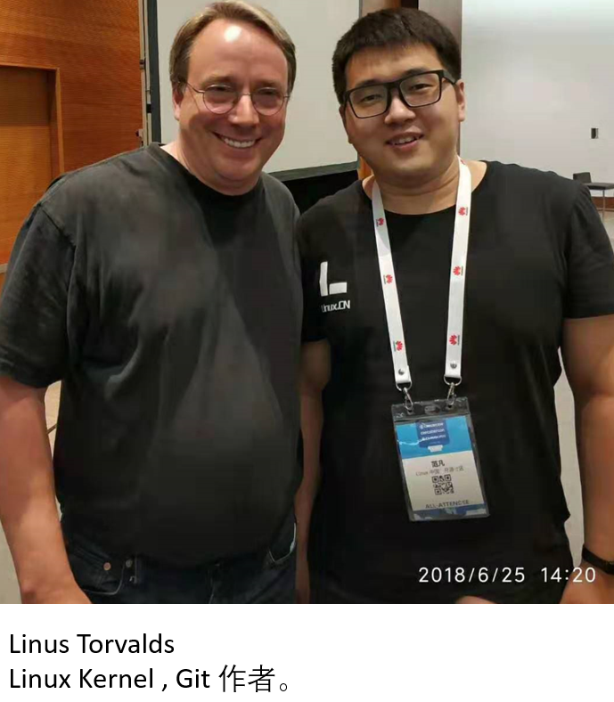
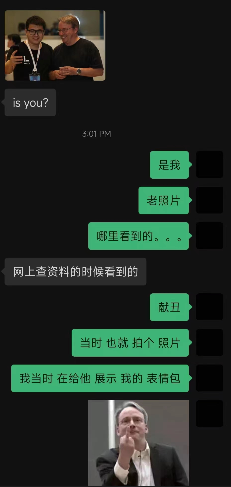

# 04-我的  标杆 与 参考

## 我的标杆

### Linux Torvalds

<figure><figcaption></figcaption></figure>

与名人合影并不能让你的生活变得更美好，身上的技能该迭代迭代，该打磨打磨，默默努力做到行业的前5%就好。

我当然希望自己能够成为像 Linus Torvalds 一样的人，通过自己的作品能够成功的帮助工业界迭代，改变世界。我记得照片中的那次 LC3大会，托老王的福终于能够和心目中的大佬合个影，当天我整个人都是[懵逼的状态](https://linux.cn/article-9779-1.html)。只记得当时在整个会议开场前，主持人有说来介绍一下你自己吧，性格一向内向的 Torvalds举起话筒慢慢的说：“I'm the author of Linux Kernel and Git, and nothing more.”（我是Linux 内核，还有Git的作者，然后就没有了）说完台下全场一片欢呼。

怎奈当时的我能力有限，唯一可以和大佬分享的是他在吐槽英伟达时候我截图做出来的一个表情包。瞬间被摄影师抓拍到从此就在互联网上稀里糊涂的留下了一个外人看起来看似很厉害的场景照片。多年后被别人翻出来自己还羞愧的不行。

<figure><figcaption></figcaption></figure>

真希望自己下次和 Torvald合作的时候是我提交了某些代码到Linux Kernel的库中，而不是在这里分享我的沙雕表情包，时光不等人的，Fine 你抓紧吧。

### Life of an open source developer

在学习Linux LFD 103课程的时候 发现有张图还是可以用啦做参考的。

<figure><figcaption></figcaption></figure>

Window Shopper 窗口购物者，就是把内核拿来就用。当你拥有一台正在运行着的企业级Linux系统的时候就是这样。

Slient Observer 安静的观察者，当你把内核的库克隆下来，然后每天静静观察里面的更新，默默关注邮件列表的时候。

New contributor 新的贡献者，当你开始提交 PR，MR 把你认为能够将Kernel变得更好的代码提交到库中的时候。

User (tester!)  用户 （测试者），真正用的时候，能够发现问题，并进行相关的提交和反馈。

Active coontributor 活跃的贡献者，总是不断的提交新的代码到Kernel的库中，让她变得更美好。

Expert contributor 专家贡献者，当有一天你发现在内核的庞大目录树中，对于其中的一部分你的理解比其他所有人都深刻的时候。

Maintainer 维护人员，参与版本维护过程。

当然在实际操作中，我们关注的领域肯定不止一个。就好比去饭店点菜肯定不能每次都点鱼香肉丝，玩手机游戏肯定不能每次都是 王者荣耀。

愿我能走到 Expert contributor。

### 另外，非常重要的一点，英文！！！



片段来自 《野蛮秘籍》54:21 - 54:37

尽管我写的这些博客文章 是中文的，但是，我在学习过程中，很多很多的资料都是英文。

所以，英文真的是非常的重要呢！！！ &#x20;

英文非常重要！英文非常重要！英文非常重要！

重要的事情说三遍。

不求与老外对答如流，雅思托福高分过关。

但求，你能：

&#x20;   遇到生词有勇气去查，

&#x20;   看到整屏的英文不头疼，

&#x20;   开着个翻译软件能够慢慢耐心读完。

简单分享一下我的英文学习经历，我是从2009年就离开学校了。从那个时候起，我就再也没有有问题可以问老师的机会了，没有了期中期末考试的困扰，但是每次遇到英文的说明书、操作页面、系统报错、新知识的教材、最新的未汉化的游戏、没有来得及生成字幕的盗版电影 的时候我都会无比郁闷，我写了那么多年的试卷A B C D 怎么就是还是不能 像中文一样 听说读写 丝滑顺畅呢？ 一定是我的技能点加的还不够，于是乎我从2015年开始自掏腰包，去 刷副本涨经验，51talk，新东方，English101.com ，狂刷美剧，狂记台词，疯狂模仿。就这样稀里糊涂的来到了外企，似乎还够用。但是，我仍然知道我的英语听力还是需要多打磨，因为国外的同事 稍微一说快一点我就蒙了。

## 我的参考

我来到红帽以后被分配到了Kernel Storage 组，脑袋中一堆疑问，以为来了以后是大佬带着刷副本涨经验，结果发现还是开局一条狗，装备全靠捡。后来聊了一下发现其实大家人都很好，他们是真不知道。幻灭过后就让我来发光吧。这里会放一些我学习路上的参考，会不断的更新。

### 基础技能参考

#### git 的参考书籍

实际工作中的复杂场景有时候来不及让你慢慢查手册，我对于新手的建议是，先弄明白基础的配置流程和基本的 概念  ， 先学会  push pull的过程，然后去看一下git lab的 MR  和 git hub的 PR 过程。之后就遇到啥自己总结归纳就好。

但是我真的一直很想写出一套关于git的 先关 图文教程，因为我看了几套教程之后发现里面的解释并不能够让我理解，也许是我的问题。



#### GNU C 语言参考手册

是的整个Linux 世界 离不开 [GNU](https://www.gnu.org/)项目。缘起UNIX ，和Linux的关系我抛砖引玉的录了个视频，放在了B站。《[Unix-Like OS 简史,Unix Linux 傻傻的分不清？ RHEL Fedora CentOS 又是啥 什么 还有Ubuntu？ 都是啥关系？](https://www.bilibili.com/video/BV1eT4y1B7gn/?vd\_source=ec754628ea1727d1b22bfbb19d01131b)》Linux Kernel当中的很多内核也是用C语言写的，所以我这里放一个 GNU C的 参考手册。



### 内核相关参考

#### Linux Foundation  LFD 103 课程

一套Linux基金会上面搜出来的课程，挺好的可以看看。唯一要提醒的地方就是，按照里面的教程做的话请安装最新版本的 Fedora 版本。然后，克隆下来最新的kernel 库之后用最新的主分支去编译就好了。



#### Linux Kernel in a nutshell

这个是有一次编译内核遇到问题之后，和同事们讨论，同事推荐的一个网站，里面的内容非常经典。后面的章节中也会穿插着讲解里面的内容。



