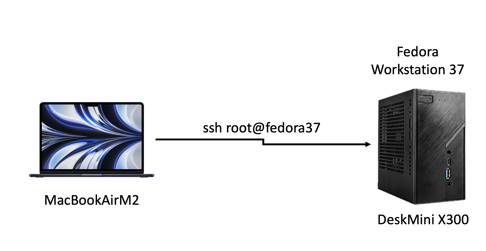
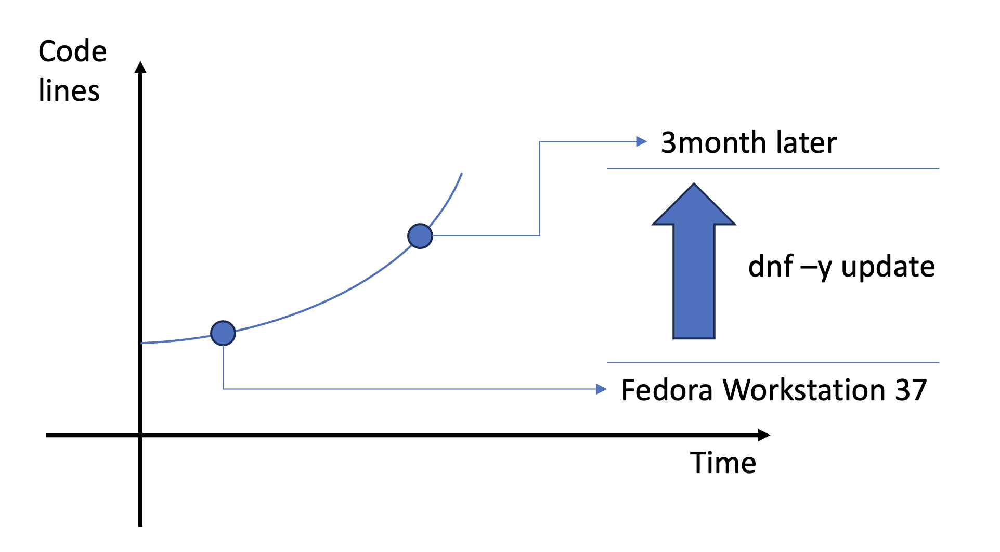

# 06-另找个车库，准备好你的Fedora Workstation

## 首先你需要另一个车库。------ 桌面端的操作系统

这里说的车库其实就是一台自己的Fedora Workstation，搭建好了之后，我们就可以在里面 疯狂的整活了，重新下载最新的内核代码，编译最新版本的内核，修改内核参数，应用最新的内核等灯。我知道大部分人在实际工作中 其实用的都是 Microsoft 公司出品的 Windows系统，或者是苹果公司的Mac系统。

&#x20; 请相信我 如果你之前用这些系统就请继续使用， 因为当年那个热血少年的我，真的就愣头青的把自己的Windows笔记本全盘重装成了 一台 Ubuntu，之后就从发现QQ不好用，中文舒服法格外智障，word文档没法编辑。。。等等， 开始了 一路踩坑之路，耽误了自己的正常工作不说。最最重要的是当我 一通 鼓捣完了 wine+ 魔兽世界之后，发现 软件的 能用和 好用 之间  差着十万八千里。


&#x20; 所以在这里我希望能够帮助你少走弯路。大家在学习的过程中可能需要一边操作，一边写云笔记方便日后查看，目前国内能用的几款笔记基本上都是在Windows 和 Mac上面的能够运行的。在Linux 桌面端大家基本都不支持。所以我在这里希望大家能够找到另外的一台性能比较强的机器进行安装 Fedora Workstation然后再远程上去进行相关的调试。这样做有几个好处：

1. 不会耽误你的日常工作学习。
2. 更方便的记录笔记和查资料。
3. 当内核编译出问题的时候，你至少有一台能用的电脑。


我这边用的是一台 Mac BookAir M2  远程连接一台 迷你桌面盒子，如下图所示

<figure><figcaption></figcaption></figure>


## 之后，整理一下你的车库 Fedora Workstation 37

这里说明一下 在安装成功之后你需要对你的系统进行哪些调整，来完成你的桌面工作站的配置。

安装的过程我这里就不再赘述了。我这里就先假设大家都很顺利的安装了 Fedora Workstation 37 的系统。并且进入了GNOME 桌面 ，打开了 Gnome-Terminal。


首先，先讲自己的Fedora Workstation 37 更新到最新的版本，使用以下命令：

```
// 更新Fedora Workstation 37 到最新的版本
# dnf -y update 
```


其实这种开源的系统，不管是 桌面端的 Workstation还是 服务器端的 Server版本 都需要定期更新的。原理如下图

<figure><figcaption></figcaption></figure>

来自全球各地的开发者们利用互联网和代码管理网站，每天都在更新组件的更新，其中包含有功能更新，也有安全更新等等。

如果更新中包含了kernel相关的rpm包，则我们需要重启一下。如下图 你的命令行提示符可能和我的有些不一样，不用担心我在后面会进行详细的解释。


