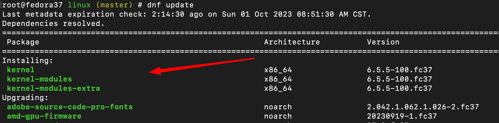
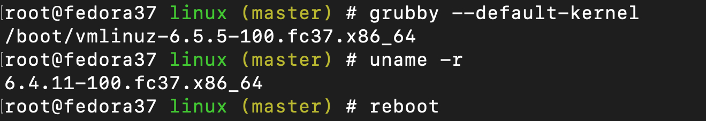
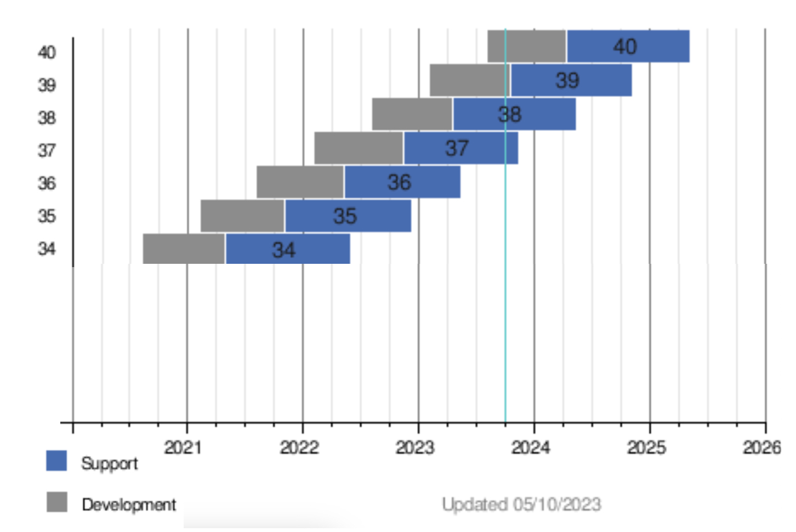
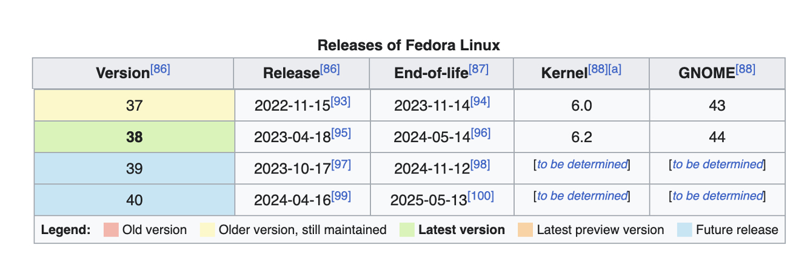
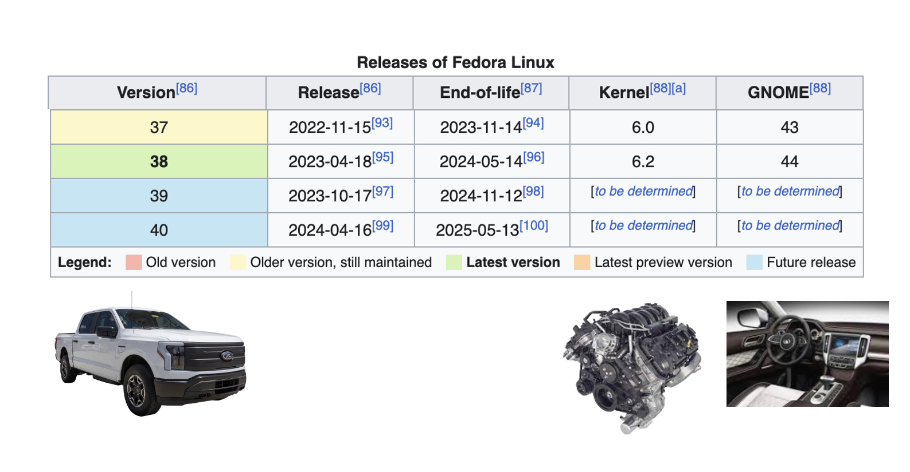
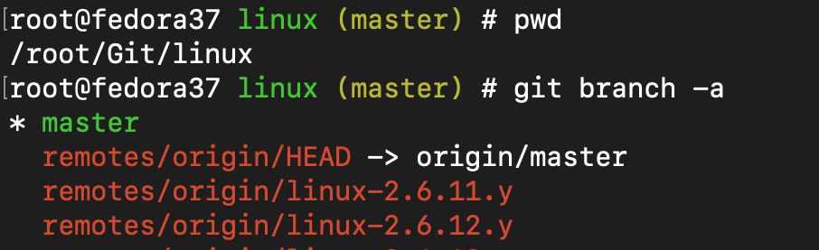

# 06-另找个车库，准备好你的Fedora Workstation

## 首先你需要另一个车库。------ 桌面端的操作系统

这里说的车库其实就是一台自己的Fedora Workstation，搭建好了之后，我们就可以在里面 疯狂的整活了，重新下载最新的内核代码，编译最新版本的内核，修改内核参数，应用最新的内核等等。我知道大部分人在实际工作中 其实用的都是 Microsoft 公司出品的 Windows系统，或者是苹果公司的Mac系统。

&#x20; 请相信我 如果你之前用这些系统就请继续使用， 因为你当前的操作习惯和应用环境其实已经达到了一个让你自己感觉舒服的平衡点了，如果你想跨出舒适圈学点东西，当我们感到不舒服的时候最好能够找到回来的路。


&#x20; 曾经那个热血少年的我，真的就愣头青的把自己的Windows笔记本全盘重装成了 一台 Ubuntu，之后就从发现QQ不好用，智能拼音输入法变成了智障拼音输入法，word文档没法直接编辑，或者你强行用LibreOffice打开之后所有的代码都是乱套的……等等， 其实那会我就应该停下来了，不应该把Windows 上面的应用习惯完全的迁移到 这种 GNU/Linux的桌面系统上，但是当时的我还没有意识到问题的严重性便开始了一路踩坑之路，耽误了自己的正常工作学习不说。最最重要的是当我 一通 鼓捣完了 wine+ 魔兽世界之后，根本没法正常游玩……从那个时候开始我发现关于软件的评价 “有的用” 和 “好用” 之间  差着十万八千里！然而，在日常生活中绝大部分人都还在无意识的使用者 Windows，Mac ，殊不知这后面的用户生态，产业迭代，和 软件环境 等等的迭代。


&#x20; 所以在这里我希望能够帮助你少走弯路。大家在学习的过程中可能需要一边操作，一边写云笔记方便日后查看，目前国内能用的几款笔记基本上都是在Windows 和 Mac上面的能够运行的。在Linux 桌面端大家基本都不支持。所以我在这里希望大家能够找到另外的一台性能比较强的机器进行安装 Fedora Workstation然后再远程上去进行相关的调试。这样做有几个好处：

1. 不会耽误你的日常工作学习。
2. 更方便的记录笔记和查资料。
3. 当内核编译出问题的时候，你至少有一台能用的电脑。


我这边用的是一台 Mac BookAir M2  远程连接一台 迷你桌面盒子，如下图所示

<figure><figcaption></figcaption></figure>


## 之后，整理一下你的车库 Fedora Workstation 37

当上图中右边的机器安装好系统之后，你需要对你的系统进行一些调整，来完成你的桌面工作站的配置。

安装的过程我这里就不再赘述了。我这里就先假设大家都很顺利的安装了 Fedora Workstation 37 的系统。并且进入了GNOME 桌面 ，打开了 Gnome-Terminal。


首先，先将自己的Fedora Workstation 37 更新到最新的版本，使用以下命令：

```
// 更新Fedora Workstation 37 到最新的版本
# dnf -y update 
```


其实这种开源的系统，不管是 桌面端的 Workstation还是 服务器端的 Server版本 都需要定期更新的。原理如下图

<figure><figcaption></figcaption></figure>

来自全球各地的开发者们利用互联网和代码管理网站，每天都在更新组件的更新，其中包含有功能更新，也有安全更新等等。

如果更新中包含了kernel相关的rpm包，则我们需要重启一下。如下图 你的命令行提示符可能和我的有些不一样，不用担心我在后面会进行详细的解释。

<figure><figcaption></figcaption></figure>

这里完成安装之后我们可以使用 **grubby --default-kernel** 命令来查看一下系统下一次启动时默认的内核是什么， **uname -r** 查看的是当前正在运行的内核


<figure><figcaption></figcaption></figure>

为了方便记忆，我在我脑袋中的图片想的是这样的一张图。

<figure><figcaption></figcaption></figure>

虽然说Linux 最强悍的地方就是可以动态升级不用重启，但是由于Kernel 这个包实在是太过于特殊，所以在更新完成Kernel的包之后就必须要进行重新启动才能将更新的包应用在当前的系统之上。上图中为了方便大家观看，我把完整的 Kernel rpm 名称中的其他部分都删掉了，只留下来数字方便大家通过比较数字大小来判断哪个更新，数字越大版本越新。


## 关于Fedora 的生命周期&#x20;

在这里我想简单说一下关于Fedora 项目的生命周期问题。具体的阐述可以在网页上找到具体的描述[https://docs.fedoraproject.org/en-US/releases/lifecycle/](https://docs.fedoraproject.org/en-US/releases/lifecycle/)&#x20;

Fedora 项目大约每六个月发布一个新版本的 Fedora Linux，并为这些版本提供大约 13 个月的更新包（维护）。&#x20;

引用一个 维基百科的 甘特图可能更为清晰



上图来自网页[https://en.wikipedia.org/wiki/Fedora\_Linux](https://en.wikipedia.org/wiki/Fedora\_Linux)


上图猛一下看起来可能有点过大，我来节选一下近期的版本发布图

<figure><figcaption></figcaption></figure>

其实在 维基百科的页面中还有一个表格 也列出来了具体的计划日期，为了方便我们将那个大表格也截选出近期的版本方便大家观看学习。

<figure><figcaption></figcaption></figure>

上图中最左边的 Version 其实就是 Fedora发布的版本，我们可以将其理解为那个皮卡车的版本。

Release 是发布的日期。

End-of-life 是计划中停止更新的日期。

Kernel 就是在发布的时候所使用的 Kernel大版本号，后续可以升级。

GNOME 是一套桌面系统，我们如果拿皮卡车的模型来类比的话，可以看作是汽车的内饰面板。

<figure><figcaption></figcaption></figure>

当有了这些基础的概念框架之后，我们在后面的学习中碰到海量的知识散点的时候就不会眉头紧皱满脑焦虑了。“这是什么，这又是什么，我刚才做了什么，我要干什么来着。怎么这么多东西要学习。。”


就像是一台皮卡车一样，它上面除了发动机，控制面板，还有很多很多的系统来保证功能运行和人机交互：悬挂系统、液压系统、油路系统、电路系统、控制系统、新风系统，等等。操作系统也是一样，当我们安装完成了一台Fedora 37之后，进入GNOME 桌面你会发现上面有很多很多好玩的东西。图形界面中的GNOME 能够帮助有一个用户友好的图形桌面系统，其中有Nautilus的文件管理器，有NetworkManager相关的配置工具能够让你拥有一个图形化的网络配置工具等等。同样的，他上面也拥有很多命令行的命令，打开他们的方法就是进入到一个命令行工具当中。之后你便进入到了霍格沃兹的图书馆中，成百上千条的命令等待你的调遣，但是最重要的是，你知道你要干嘛，你知道哪条命令能够帮助你完成你想做的事情。


开源界里面几乎每一个组件背后都有一个组织、社区、一段传奇故事。有些是关于版权的，有些就是当时的场景下需要实现某些功能而开发出来的代码。

## 修改一些设置   --- 未完成


首先先介绍一些，虽然我们这里安装的是一个图形化的本地提桌面系统，但是我们在进行相关的操作的时候，大部分情况下是使用 Gnome-Shell里面的命令行页面，也就是 CLI页面。

### 允许 Root登录

CLI (Command Line Interface)操作 使用 root用户编辑/etc/ssh/sshd\_config文件,找到 **PermitRootLogin**的所在行，然后将将后面的 **prohibit-password** 换成**yes** 关键字**，如下面所示的41行**

```
39 #LoginGraceTime 2m
40 #PermitRootLogin prohibit-password
41 PermitRootLogin yes
42 #StrictModes yes
43 #MaxAuthTries 6
44 #MaxSessions 10
```

### 禁用休眠

由于在学习过程中经常需要将该机器尝试加开机并在后台运行内核运算的等的活动，所以我们在这里将系统的休眠 和挂起 功能都暂时禁用掉，使用root用户 执行以下命令既可完成：

```
systemctl mask suspend.target
systemctl mask sleep.target
```

## 修改一下默认的 shell prompt

由于在学习过程中会频繁的使用到 git 相关的文件目录树结构，在使用git 的过程中分支这相关的操作又非常的重要，所以我在这里修改了默认的**bashrc**文件，这样每当我们在进入到一个 git 相关的 repo目录的时候，当前工作目录的所在分支便会展示出来。

首先请使用root用户备份一下现有的 /etc/bashrc 文件,切换到root用户之后

```
cp /etc/bashrc /etc/bashrc_bak
```

之后使用vim 将以下内容追加到 /etc/bashrc后面

```
# To add git branch into the prompt
#
parse_git_branch() {
     git branch 2> /dev/null | sed -e '/^[^*]/d' -e 's/* \(.*\)/ (\1)/'
}

if [ $UID == "0" ];then
    export PS1="\u@\h \[\033[32m\]\W\[\033[33m\]\$(parse_git_branch)\[\033[00m\] # "
else
    export PS1="\u@\h \[\033[32m\]\W\[\033[33m\]\$(parse_git_branch)\[\033[00m\] $ "
fi

```

之后使用当前用户 读取文件以便让修改的配置生效。

```
source /etc/bashrc
```

这样当后面我们要开始手搓发动机的时候,我们会需要到上游的 Git库中 克隆不同的代码，当一个Git库克隆到本地之后，我们需要时刻清楚自己在哪个分支上做事情，这样就不会掉到坑里，默认情况下我们需要一遍又一遍的重复git branch 的命令，为了方便 我将Git库中的branch 信息默认打印到了 Shell Promopt中

<figure><figcaption></figcaption></figure>

上图中黄色的(master)就是  我想在呈现的 branch内容。


