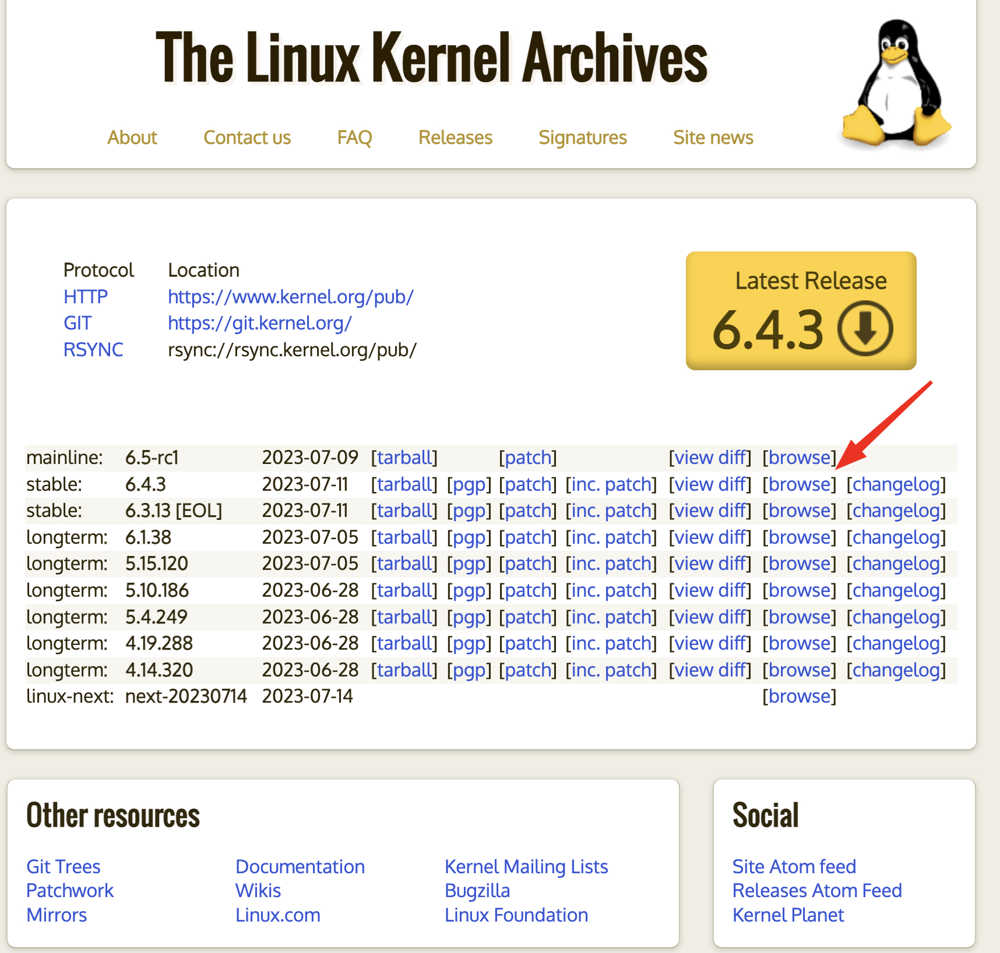
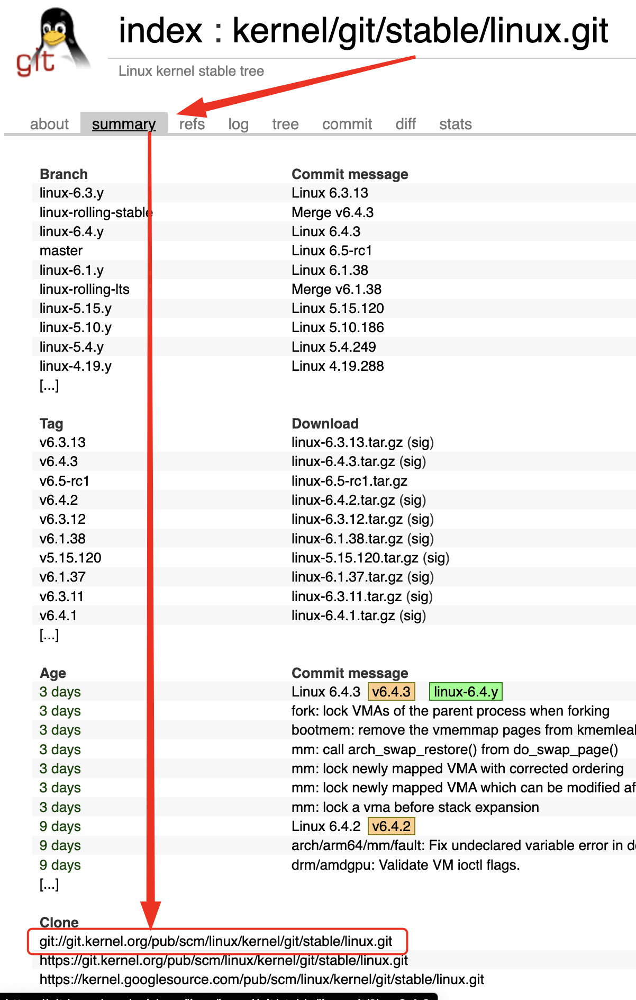
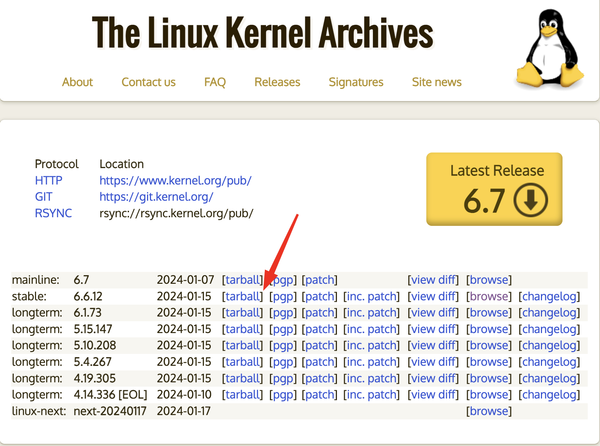
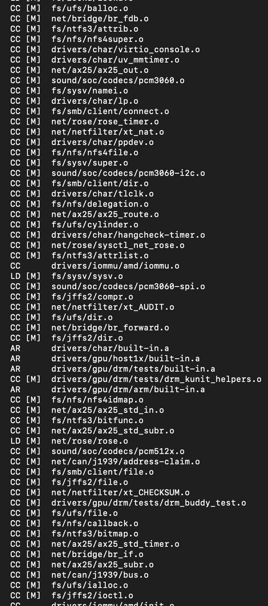

# 07-开始手搓，开始在Fedora上编译内核

## 开始手搓

接下来我们就开始尝试亲手编译一个内核 并启动。

#### 准备零件

首先，我们需要拿到上游供应商的零件。





<figure><figcaption></figcaption></figure>


#### 准备工具


以下是你需要的工具。

vim&#x20;

gcc

make

git

wget

tmux


```shell
// 切换到 root用户然后使用 dnf 安装先关的rpm包
[fine@fedora37 ~]$ sudo su - root
[sudo] password for fine: 
[root@fedora37 ~]# dnf -y install wget gcc make vim tmux

```


<figure><figcaption></figcaption></figure>

切换到root用户之后，在当前目录下 创建一个Git的目录，进入Git目录，并且开始tmux

```
[root@fedora37 ~]# mkdir Git
[root@fedora37 ~]# cd Git/
[root@fedora37 Git]# tmux
[root@fedora37 Git]# git clone git://git.kernel.org/pub/scm/linux/kernel/git/stable/linux.git
Cloning into 'linux'...

# 在这里 国内的用户可能要久等一下

remote: Enumerating objects: 11599348, done.
remote: Counting objects: 100% (1839/1839), done.
remote: Compressing objects: 100% (797/797), done.
Receiving objects:   0% (270/11599348), 228.01 KiB | 16.00 KiB/s

# 之后这里也要等待好久
```

由于这里等的太久。。经过一番询问之后，发现我们还是 去下载那个 tarball吧。。这样的话就不用下载里面的git记录。我们体验一把从源码编译内核到二进制的过程，后面再说调参，和查看日志。啥的。

<figure><figcaption></figcaption></figure>

w

```
wget  https://cdn.kernel.org/pub/linux/kernel/v6.x/linux-6.6.12.tar.xz
--2024-01-17 19:05:22--  https://cdn.kernel.org/pub/linux/kernel/v6.x/linux-6.6.12.tar.xz
Resolving cdn.kernel.org (cdn.kernel.org)... 151.101.77.176, 2a04:4e42:12::432
Connecting to cdn.kernel.org (cdn.kernel.org)|151.101.77.176|:443... connected.
HTTP request sent, awaiting response... 200 OK
Length: 140062260 (134M) [application/x-xz]
Saving to: ‘linux-6.6.12.tar.xz’

linux-6.6.12.tar.xz                                           50%[======================================================================>                                                                      ]  67.86M  9.34MB/s    eta 4s     

```

这里的速度果然嘎嘎快。下载完之后就是解压然后我们来看一眼里面的结构。


```
tar -Jxvf linux-6.6.12.tar.xz
//下面的输出省略一万字
```


```
// Some code
root@X300F36 kernel.org # ls
linux-6.6.12  linux-6.6.12.tar.xz
root@X300F36 kernel.org # cd linux-6.6.12/
root@X300F36 linux-6.6.12 # ls -l
total 1004
drwxrwxr-x.  24 root root   4096 Jan 16 01:57 arch
drwxrwxr-x.   3 root root   4096 Jan 16 01:57 block
drwxrwxr-x.   2 root root   4096 Jan 16 01:57 certs
-rw-rw-r--.   1 root root    496 Jan 16 01:57 COPYING
-rw-rw-r--.   1 root root 102435 Jan 16 01:57 CREDITS
drwxrwxr-x.   4 root root   4096 Jan 16 01:57 crypto
drwxrwxr-x.  76 root root   4096 Jan 16 01:57 Documentation
drwxrwxr-x. 143 root root   4096 Jan 16 01:57 drivers
drwxrwxr-x.  81 root root   4096 Jan 16 01:57 fs
drwxrwxr-x.  31 root root   4096 Jan 16 01:57 include
drwxrwxr-x.   2 root root   4096 Jan 16 01:57 init
drwxrwxr-x.   2 root root   4096 Jan 16 01:57 io_uring
drwxrwxr-x.   2 root root   4096 Jan 16 01:57 ipc
-rw-rw-r--.   1 root root   2573 Jan 16 01:57 Kbuild
-rw-rw-r--.   1 root root    555 Jan 16 01:57 Kconfig
drwxrwxr-x.  22 root root   4096 Jan 16 01:57 kernel
drwxrwxr-x.  21 root root  12288 Jan 16 01:57 lib
drwxrwxr-x.   6 root root   4096 Jan 16 01:57 LICENSES
-rw-rw-r--.   1 root root 726660 Jan 16 01:57 MAINTAINERS
-rw-rw-r--.   1 root root  67433 Jan 16 01:57 Makefile
drwxrwxr-x.   6 root root   4096 Jan 16 01:57 mm
drwxrwxr-x.  73 root root   4096 Jan 16 01:57 net
-rw-rw-r--.   1 root root    727 Jan 16 01:57 README
drwxrwxr-x.   7 root root   4096 Jan 16 01:57 rust
drwxrwxr-x.  41 root root   4096 Jan 16 01:57 samples
drwxrwxr-x.  17 root root   4096 Jan 16 01:57 scripts
drwxrwxr-x.  14 root root   4096 Jan 16 01:57 security
drwxrwxr-x.  27 root root   4096 Jan 16 01:57 sound
drwxrwxr-x.  43 root root   4096 Jan 16 01:57 tools
drwxrwxr-x.   4 root root   4096 Jan 16 01:57 usr
drwxrwxr-x.   4 root root   4096 Jan 16 01:57 virt
root@X300F36 linux-6.6.12 # 
```

\######//待补充：  这里需要有一个 各个目录的简单介绍。


#### 开始手搓

内核配置保存在操作系统顶层目录中名为 .config 的文件中 内核源代码树。 如果你刚刚解压缩了内核源码，解压出来的目录中会没有 .config 文件，因此需要创建它。 它可以从头开始创建，执行下面的命令，会让系统基于当前的配置写入到.config文件中


```
// 在这里我们直接用机器上现有的 内核配置文件 放到当前目录下使用
 cp /boot/config-$(uname -r) ./.config
// 由于还有一些没有回答的问题 我们先使用下面的 命令来将剩下的问题重置为默认
make menuconfig
// 真正开始编译内核  ,调用16个 worker来编译内核
make -j 16
```

之后就是漫长的等待了


<figure><figcaption></figcaption></figure>


\#######//待补充： 这里要说一下  前面的 CC 啊 LD 啊  啥的 方括号里的 啥的 都是什么意思

整个 编译过程中大概需要 30-40分钟不等，具体的时长根据你的机器性能来决定。


#### 首次运行


